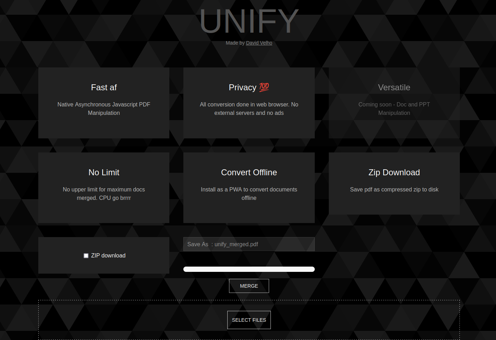

# UNIFY

Modern PDF Merging website focused on usability and ease of use. All conversions done client side.


## Screenshots



  
## Features

- Maximum privacy. No uploads to server. All conversion done in browser
- No limit on number of PDFs converted
- Offline support via PWA
- Save file as compressed zip

  
## Deployment

Production build : 

```bash
  npm run build
```

Dev server :

```bash
npm start
```
  
## Authors

- [@DavidVelho](https://github.com/theProgrammerDavid)

  
## Roadmap

- Doc and PPT manipulation

- PDF compression
